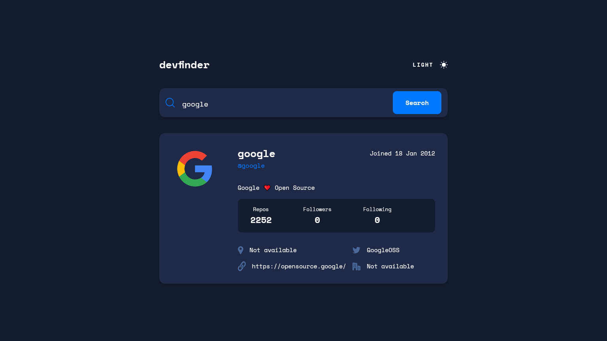
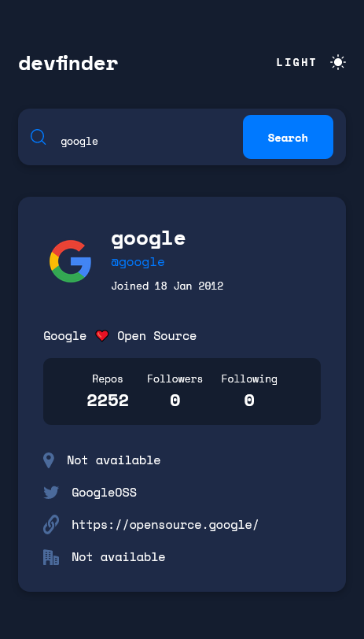
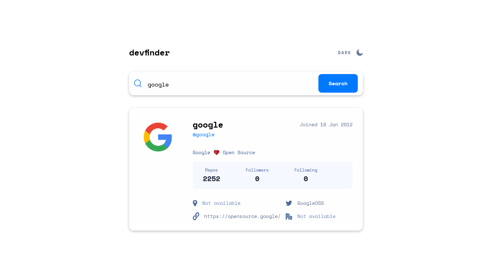
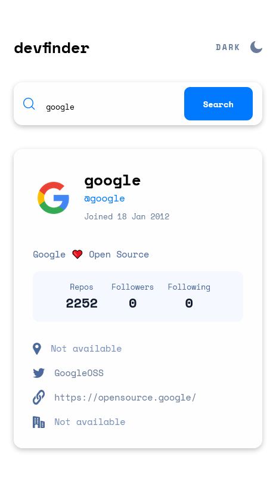

# Frontend Mentor - GitHub user search app solution

This is a solution to the [GitHub user search app challenge on Frontend Mentor](https://www.frontendmentor.io/challenges/github-user-search-app-Q09YOgaH6). Frontend Mentor challenges help you improve your coding skills by building realistic projects.

## Table of contents

- [Overview](#overview)
  - [The challenge](#the-challenge)
  - [Screenshot](#screenshot)
  - [Links](#links)
- [My process](#my-process)
  - [Built with](#built-with)
  - [What I learned](#what-i-learned)
  - [Continued development](#continued-development)
  - [Useful resources](#useful-resources)
- [Author](#author)
- [Acknowledgments](#acknowledgments)

## Overview

### The challenge

Users should be able to:

- View the optimal layout for the app depending on their device's screen size ✓
- See hover states for all interactive elements on the page ✓
- Search for GitHub users by their username ✓
- See relevant user information based on their search ✓
- Switch between light and dark themes ✓
- **Bonus**: Have the correct color scheme chosen for them based on their computer preferences. _Hint_: Research `prefers-color-scheme` in CSS. ✓

### Screenshot






### Links

- Repo URL: [Add solution URL here](https://github.com/Clytax/github)
- Live Site URL: [Live URL](https://github-eta-ten.vercel.app/)

## My process

### Built with

- Semantic HTML5 markup
- CSS custom properties
- SCSS
- BEM Naming
- Flexbox
- CSS Grid
- Mobile-first workflow!
- [React](https://reactjs.org/) - JS library

### What I learned

After the last challenge I participated in, I learned a lot about responsive design! Some people from this great community advised me not to set fixed heights, which I didn't do this time :)

### Continued development

I struggled with using Context, I tried things like "Zustand" which I just couldn't manage to put on the "No Results" screen for some reason. Sometimes it didn't set the error message when I checked if

```javascript
if (!response.ok) {
  setError(true);
}
```

the state has not changed. No idea why.

### Useful resources

- [Kevin Powell](https://www.youtube.com/kepowob) - I can't stress enough how helpful Kevin Powell was/is to me. His videos are so amazing and have helped me a lot in understanding web design!

## Author

- Frontend Mentor - [@Clytax](https://www.frontendmentor.io/profile/Clytax)
- Twitter - [@EinfachCoden](https://twitter.com/EinfachCoden)

## Acknowledgments

I want to thank the people who commented on my last posts, you guys helped me a lot!
@FluffyKas | @alosoft
